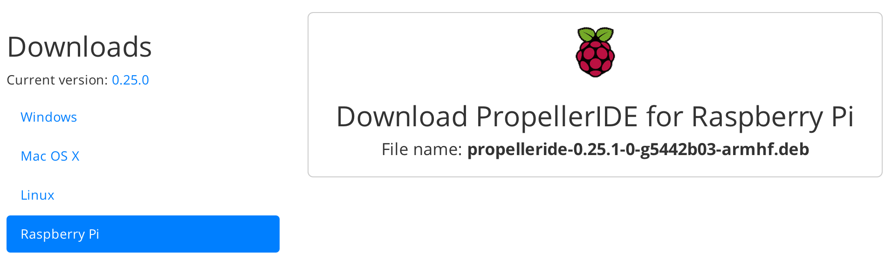

Propeller HAT, the 8-core microcontroller add-on for your Raspberry Pi.

Available now from Pimoroni: http://shop.pimoroni.com/products/propeller-hat


Propeller HAT is licensed under a Creative Commons Attribution-ShareAlike 4.0 International License.: http://creativecommons.org/licenses/by-sa/4.0/

###Features

* 8-core Parallax Microcontroller on-board
* 30 IO pins broken out, serial data/programming connection to Pi
* 20 Pi pins broken out for communications/ease of access
* 170pt breadboard for experimentation
* Python quick start library with PWM/Servo and GPIO libraries


###Getting started

For instant-gratification you can try the Propeller HAT IO libraries:

* [IO using Serial](documentation/Serial-IO.md)
* [IO using i2c](documentation/IO.md)
* [PWM for LEDs/Servos](documentation/PWM.md)

You'll need Propeller IDE to start programming your Propeller HAT:

* [Propeller IDE Getting Started](/documentation/Propeller-IDE-Getting-Started.md)

##Propeller IDE Installation

As always, we've made it super-easy for you to get all the software you need with a nifty one-line installer. To run it fire up Terminal which you'll find in Menu -> Accessories -> Terminal on your Raspberry Pi desktop like so:


In the new terminal window type:

```bash
curl -sS get.pimoroni.com/propellerhat | bash
```

This will install a fairly recent version of the Propeller IDE but if you'd like you can head over to [www.lamestation.com/propelleride/](http://www.lamestation.com/propelleride/) and grab the latest
version of Propeller IDE for the Raspberry Pi, which may be newer than the one installed by the one-line installer.



It's easier if you grab the right URL, and use the wget command on your
Raspberry Pi to download it. For example:

```bash
wget https://github.com/parallaxinc/PropellerIDE/releases/download/0.36.7/propelleride-0.36.7-armhf.deb
```

Once downloaded, you can install it with:

```bash
sudo dpkg -i propelleride-0.36.7-armhf.deb
```

###Documentaton & Support

* Tutorials - https://learn.pimoroni.com/propeller-hat
* GPIO Pinout - https://pinout.xyz/pinout/propeller_hat
* Get help - http://forums.pimoroni.com/c/support

###Repository Contents

###Documentation

Everything you need to get started with Propeller IDE and your first
SPIN program.


####Software

Suport software and Python-based uploader tool.

* python - Python library for Propeller HAT with PWM and GPIO functions
* sidplay - Play SID tune dumps with Propeller HAT
* p1load - Installer and binary for Pi-compatible p1load


####Datasheets

Datasheets for Parallax Propeller and Crystal Oscillator.
