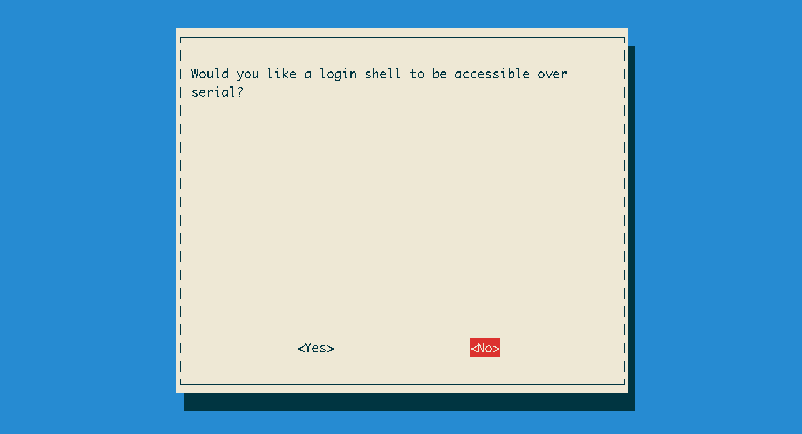

<!--
---
title: Getting started with Propeller IDE
handle: propeller-ide-getting-started
type: tutorial
summary: Learn how to install Propeller IDE, the development environment for Propeller HAT
author: Phil Howard
products: [propeller-hat]
tags: [Propeller HAT, Raspberry Pi, Microcontroller]
images: [images/tba.png]
difficulty: Intermediate
-->
#Propeller IDE Getting Started

##Raspberry Pi 3

The Raspberry Pi 3 does strange things with Serial for the benefit of Bluetooth. Unfortunately this completely trounces `propman` and any other Propeller HAT loader. You can fix it by making sure your Pi 3 is up-to-date ( `sudo apt-get update && sudo apt-get upgrade` ) then edit `/boot/config.txt` and adding the line:

```
dtoverlay=pi3-miniuart-bt
```

##Raspbian Jessie

With the [release of Raspbian Jessie](https://www.raspberrypi.org/downloads/raspbian/), Qt5.3 is available without having to mess about with adding new sources and installing things from backports. If you're using Raspbian Jessie then just:

* Download the latest Propeller IDE from: http://developer.parallax.com/propelleride/
* Install with: `sudo dpkg -i propelleride-*`
* Install dependencies with `sudo apt-get install -f`

That's it!

##Update

Propeller IDE 0.36.7 is the latest recommended build. These instructions have been updated to reflect the 0.36.7 install process. Enjoy!

You can find out more about the new Propeller IDE here: https://github.com/parallaxinc/PropellerIDE/releases/tag/0.36.7

##Preface

Learning to program isn't just about mastering a particular programming language
and applying it in every situation. It's about learning the key concepts
and applying them to a wealth of different situations in many languages.

The phrase "If you've only got a hammer, everything looks like a nail," springs to mind.
Different circumstances often beg for, or even require, different programming languages.

**SPIN**

The native language of the Parallax Propeller is SPIN. Spin is a little Pythonic in nature, 
it uses spaces and indentation a syntax.

It also borrows a lot of syntax quirks from other languages, and thus isn't going to be
familiar from the get go. That's no problem, you'll master it in no time!

**Propeller IDE**

The weapon-of-choice software for writing Propeller SPIN is the Open-Source Propeller IDE.
It runs on the Raspberry Pi pretty well, and we've made sure you can upload code right onto
your Propeller HAT painlessly so you can get programming quickly and avoid the hassle of setting up.

The great thing about Propeller IDE, SPIN and the Propeller is that they're close-knit and
unencumbered by the need to support lots of different processors. This makes compiling and uploading
SPIN code absolutely lightning fast- Arduino users will be simply blown away.

##First Steps

###Installing Pre-requisites ( Raspbian Wheezy only )

If you're running Raspbian Jessie, please skip to Installing Propeller IDE below.

Raspbian Wheezy needs a little helping hand with some of Propeller IDE's dependencies, but hopefully a future
release will see the end of these steps.

First, you'll need to install the `apt-transport-https` package for apt:

```
sudo apt-get install apt-transport-https
```

Next, add the following entries to `/etc/apt/sources.list` ( Note the "https://" and the lack of "main" ):

```
deb https://twolife.be/raspbian/ wheezy backports
deb-src https://twolife.be/raspbian/ wheezy backports
```

Add the repository key.

```bash
sudo apt-key adv --keyserver keyserver.ubuntu.com --recv-key 2578B775
```

And finally update and install Qt5 and its dependencies, plus libftdi1 for the loader.

```bash
sudo apt-get update
sudo apt-get install qt5-default qt5-qmake libqt5serialport5 libegl1-mesa libgles2-mesa libftdi1
```

Once that is done, you may want to comment out or remove the entries added to sources.list as they are no longer necessary. To do this, simply place a `#` before them, like so:

```
#deb https://twolife.be/raspbian/ wheezy backports
#deb-src https://twolife.be/raspbian/ wheezy backports
```

###Installing Propeller IDE

Now, head over to [developer.parallax.com/propelleride/](http://developer.parallax.com/propelleride/) and grab the latest 
version of Propeller IDE for the Raspberry Pi.


It's easier if you grab the right URL, and use the wget command on your 
Raspberry Pi to download it. For example:

```bash
wget https://github.com/parallaxinc/PropellerIDE/releases/download/0.36.7/propelleride-0.36.7-armhf.deb
```

Once downloaded, you can install it with:

```bash
sudo dpkg -i propelleride-0.36.7-armhf.deb
```

###Turning off the Serial Terminal so you can talk to Propeller HAT

By default, the Raspberry Pi fires up a serial terminal on /dev/ttyAMA0. This is handy for debugging headless, but if you're using Propeller IDE and programming a Propeller HAT then you've likely got a monitor plugged in anyway!

The serial terminal must be disabled so that we can communicate with Propeller HAT. Fortunately, raspi-config makes this easy:

```bash
sudo raspi-config
```

Then navigate to Advanced Options, find the Serial option and disable it.



###Making sure propman can access your Raspberry Pi's GPIO pins

On Wheezy we need propman to run as root, so it can access the GPIO pin used for resetting Propeller HAT:

```bash
sudo chown root:root /usr/bin/propman
sudo chmod 4755 /usr/bin/propman
```

propman defaults to using GPIO pin 17, pulled low when built for the Raspberry Pi, so this is all we need to do. You're good to go! Uploading code is as simple as:

```bash
propman my-binary-file.binary
```

And to compile a SPIN file to a binary outside of the IDE, you can:

```bash
openspin my-spin-file.spin
```

#What next?

* [Your first SPIN program](/documentation/Your-first-SPIN-program.md)
