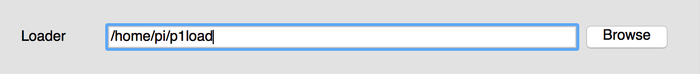

#Propeller IDE Getting Started

##Preface

Learning to program isn't just about mastering a particular programming language
and applying it in every situation. It's about learning the key concepts
and applying them to a wealth of different situations in many languages.

The phrase "If you've only got a hammer, everything looks like a nail," springs to mind.
Different circumstances often beg for, or even require, different programming languages.

**SPIN**

The native language of the Parallax Propeller is SPIN. Spin is a little Pythonic in nature, 
it uses spaces and indentation a syntax.

It also borrows a lot of syntax quirks from other languages, and thus isn't going to be
familiar from the get go. That's no problem, you'll master it in no time!

**Propeller IDE**

The weapon-of-choice software for writing Propeller SPIN is the Open-Source Propeller IDE.
It runs on the Raspberry Pi pretty well, and we've made sure you can upload code right onto
your Propeller HAT painlessly so you can get programming quickly and avoid the hassle of setting up.

The great thing about Propeller IDE, SPIN and the Propeller is that they're close-knit and
unencumbered by the need to support lots of different processors. This makes compiling and uploading
SPIN code absolutely lightning fast- Arduino users will be simply blown away.

##First Steps

###Installing Pre-requisites

Raspbian needs a little helping hand with some of Propeller IDE's dependencies, but hopefully a future
release will see the end of these steps.

First, add the following entries to `/etc/apt/sources.list`.

```
deb http://twolife.be/raspbian/ wheezy main backports
deb-src http://twolife.be/raspbian/ wheezy main backports
```

Add the repository key.

```bash
sudo apt-key adv --keyserver keyserver.ubuntu.com --recv-key 2578B775
```

And finally update and install Qt5 and its dependencies.

```bash
sudo apt-get update
sudo apt-get install qt5-default qt5-qmake libegl1-mesa libgles2-mesa
```

###Installing Propeller IDE

Now, head over to [www.lamestation.com/propelleride/](http://www.lamestation.com/propelleride/) and grab the latest 
version of Propeller IDE for the Raspberry Pi.


It's easier if you grab the right URL, and use the wget command on your 
Raspberry Pi to download it. For example:

```bash
wget https://github.com/parallaxinc/PropellerIDE/releases/download/0.25.1/propelleride-0.25.1-0-g5442b03-armhf.deb
```

Once downloaded, you can install it with:

```bash
sudo dpkg -i propelleride-0.25.1-0-g5442b03-armhf.deb
```

###Patching p1load and /dev/ttyAMA0 on the Pi

At the moment a couple of tweaks are needed to make everything run smoothly on the Pi. 

* /dev/ttyAMA0 is, by default, not visible in Propeller IDE
* p1load needs to be run as root, and passed the -Dreset=gpio,17,0 command to reset PropellerHAT

The first one is easy, and we'll make sure we've got the right permissions while we're at it:

```bash
sudo usermod -a -G dialout pi
sudo ln -s /dev/ttyAMA0 /dev/ttyUSB99
```

To make the latter command permenant, you'll need to add it to /etc/rc.local so it looks something like this:

```bash
# Print the IP address
_IP=$(hostname -I) || true
if [ "$_IP" ]; then
  printf "My IP address is %s\n" "$_IP"
fi

sudo ln -s /dev/ttyAMA0 /dev/ttyUSB99  # Add this line!

exit 0
```

Now we need p1load to run as root, so it can access the GPIO pin used for resetting Propeller HAT. These two commands should fix that up nicely:

```bash
sudo chown root /usr/share/propelleride/bin/p1load
sudo chmod 4755 /usr/share/propelleride/bin/p1load
```

Next we need to tackle p1load's GPIO reset parameter, we can do this with a simple wrapper script. It doesn't matter where you put this script, just as long as you can find it later. Save the following as p1load in your home directory:

```bash
#!/usr/bin/env bash
echo "Loading: $@"
/usr/share/propelleride/bin/p1load -Dreset=gpio,17,0 "$@"
```

Now fire up Propeller IDE, navigate to Preferences and change the path for Loader to your shiny new wrapper script:




